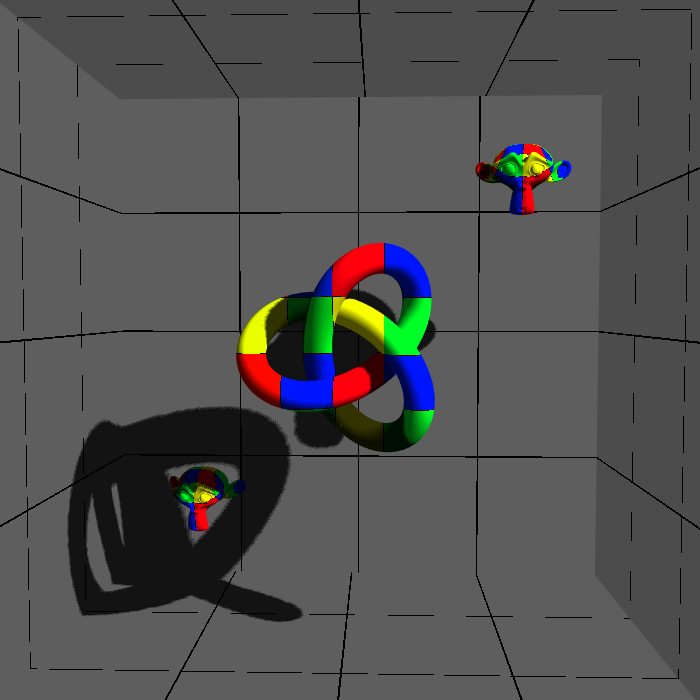

# Shadow Demo
this is a demonstration of shadow mapping in openGL

this projects uses [stb_image.h](https://github.com/nothings/stb)
and [glad](https://github.com/Dav1dde/glad)

<kdb></kdb>

## controls
|key press| action|
|:-:|-|
|w,a,s,d| fps movement controls for forward, backward, right, and left motion|
| space and shift| ascend and descend|
|mouse|look control|